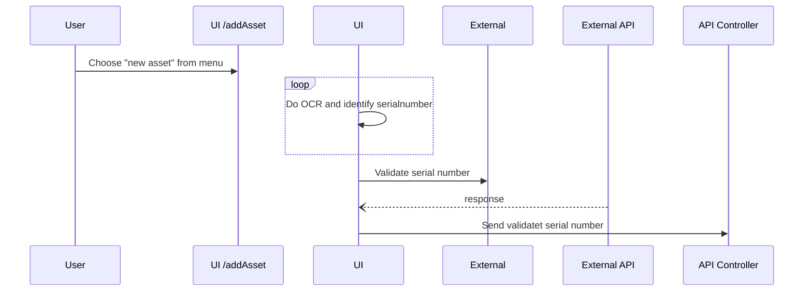

# Tag new asset

```mermaid
sequenceDiagram
    User->>UI /addAsset: Choose "new asset" from menu
    
    loop 
        UI->>UI: Do OCR and identify serialnumber
    end
    UI ->> External: Validate serial number
    activate External 
    External API --) UI: response
    UI ->> API Controller: Send validatet serial number
    
```