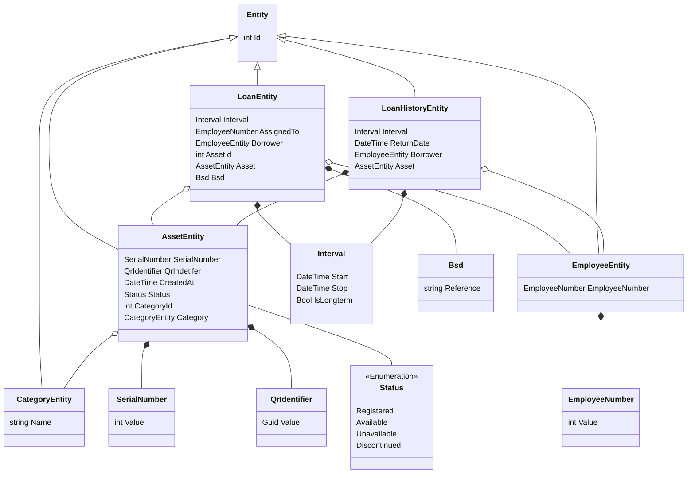

```mermaid
classDiagram
    Entity  <|-- CategoryEntity
    LoanEntity o-- EmployeeEntity

    Entity  <|-- AssetEntity
    Entity  <|-- LoanEntity
    Entity  <|-- EmployeeEntity
    Entity  <|-- LoanHistoryEntity
    AssetEntity *-- SerialNumber
    AssetEntity *-- QrIdentifier
    AssetEntity -- Status
    AssetEntity o-- CategoryEntity
    LoanEntity o-- AssetEntity
    LoanEntity *-- Interval
    LoanEntity *-- Bsd
    EmployeeEntity *-- EmployeeNumber
    LoanHistoryEntity *-- Interval 
    LoanHistoryEntity o-- EmployeeEntity 
    LoanHistoryEntity *-- AssetEntity 


    

    class Entity {
        int Id
    }
    class AssetEntity {
        SerialNumber SerialNumber
        QrIdentifier QrIndetifer
        DateTime CreatedAt
        Status Status
        int CategoryId
        CategoryEntity Category
    }
    class SerialNumber {
        int Value
    }
    class QrIdentifier {
        Guid Value
    }

    class Status
        <<Enumeration>> Status
        Status: Registered 
        Status: Available
        Status: Unavailable
        Status: Discontinued
    
    class CategoryEntity {
        string Name
    }
    class EmployeeEntity {
        EmployeeNumber EmployeeNumber
    }
    class EmployeeNumber {
        int Value
    }
    class LoanEntity {
        Interval Interval
        EmployeeNumber AssignedTo
        EmployeeEntity Borrower
        int AssetId
        AssetEntity Asset
        Bsd Bsd
    }
    class Interval {
        DateTime Start
        DateTime Stop
        Bool IsLongterm
    }
    class Bsd {
        string Reference
    }
    class LoanHistoryEntity {
        Interval Interval
        DateTime ReturnDate
        EmployeeEntity Borrower
        AssetEntity Asset
    }


```