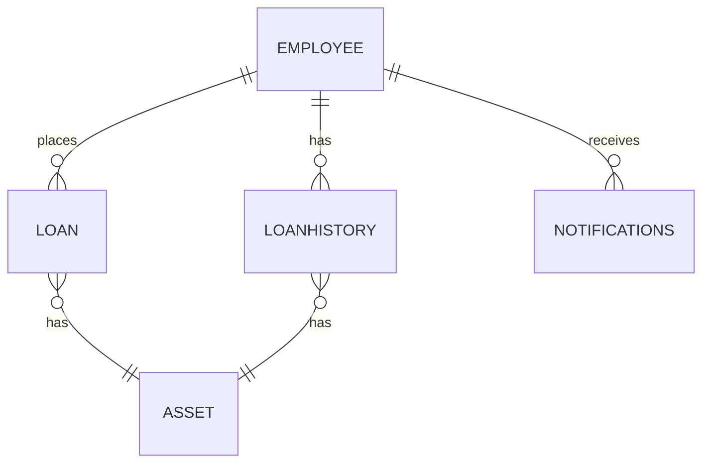

# Entity Relationship Diagram

```mermaid
erDiagram

EMPLOYEE ||--o{ LOAN : places
LOAN }o--|| ASSET : has
EMPLOYEE ||--o{ LOANHISTORY : has
LOANHISTORY }o--|| ASSET : has
EMPLOYEE ||--o{ NOTIFICATIONS : receives

      

```