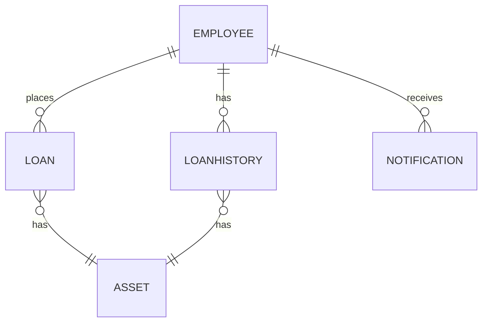

# Entity Relationship Diagram
An asset can only be part of one Loan at the time, check if the restriction is correct

```mermaid
erDiagram

EMPLOYEE ||--o{ LOAN : places
LOAN }o--|| ASSET : has
EMPLOYEE ||--o{ LOANHISTORY : has
LOANHISTORY }o--|| ASSET : has
EMPLOYEE ||--o{ NOTIFICATION : receives

      

```
