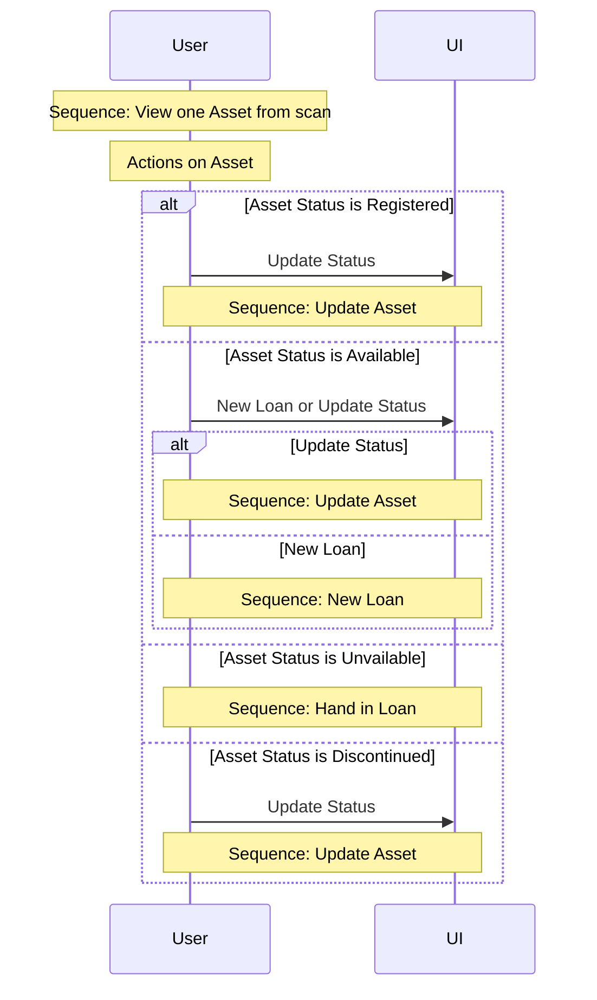

## Actions on Asset
When scanning an Asset, the Status of it decides the possible Actions available
### Used sequences in this diagram
- [Sequence: View one Asset from scan](read-Asset.md#view-one-Asset-from-scan)
- [Sequence: Update Asset](update-Asset.md#update-Asset-information-and-status-from-scan)
- [Sequence: New Loan](loan.md#new-loan)
- [Sequence: Hand in Loan](loan.md#hand-in-loan)
