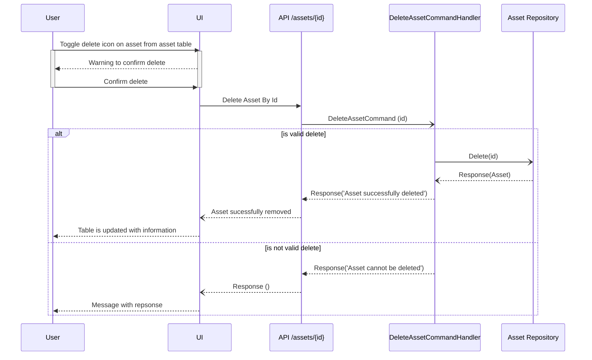

# Delete asset
## Delete wrongly added asset

```mermaid
sequenceDiagram
    User ->> UI : Toggle delete icon on asset from asset table
    Activate User
    
        Activate UI
            UI -->> User : Warning to confirm delete
            User ->> UI : Confirm delete
        Deactivate UI
    
    Deactivate User
    
    UI ->> API /assets/{id}: Delete Asset By Id
    API /assets/{id} -) DeleteAssetCommandHandler : DeleteAssetCommand (id)

    Alt is valid delete
        
        DeleteAssetCommandHandler -) Asset Repository : Delete(id)
        Asset Repository  --) DeleteAssetCommandHandler : Response(Asset)
        DeleteAssetCommandHandler -->> API /assets/{id} : Response('Asset successfully deleted')
        API /assets/{id} --) UI  : Asset sucessfully removed
        UI -->> User : Table is updated with information

    else is not valid delete
        DeleteAssetCommandHandler -->> API /assets/{id} : Response('Asset cannot be deleted')
        API /assets/{id} --) UI  : Response ()
        UI -->> User : Message with repsonse

    end
```