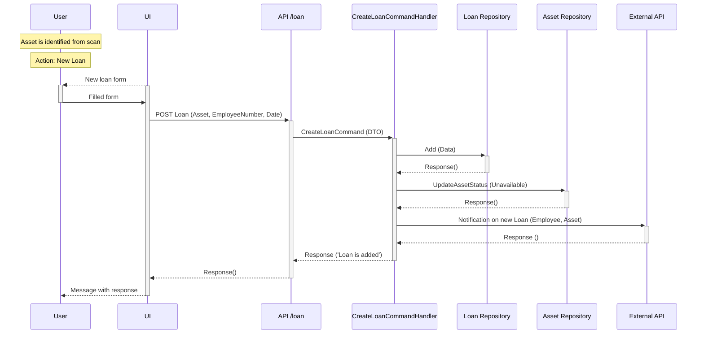
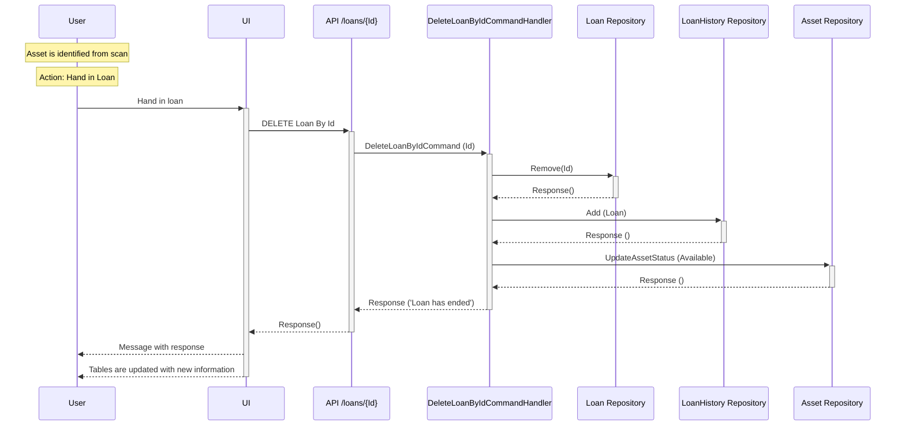
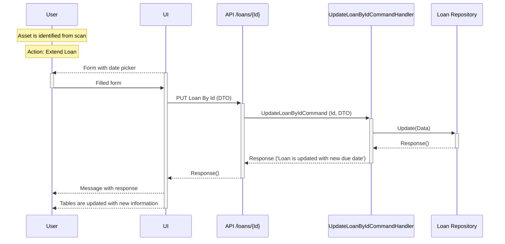

# Loan Actions
- [New Loan](#new-loan)
- [Hand in Loan](#hand-in-loan)
- [Extend Loan](#extend-loan)

## New Loan

```mermaid
sequenceDiagram
    Note over User : Asset is identified from scan
    Note over User : Action: New Loan
    UI -->>+ User : New loan form
    Activate UI 
        User ->>- UI : Filled form
            UI ->>+ API /loan : POST Loan (Asset, EmployeeNumber, Date)
                API /loan ->>+ CreateLoanCommandHandler : CreateLoanCommand (DTO)
                    CreateLoanCommandHandler ->>+ Loan Repository : Add (Data)
                    Loan Repository -->>- CreateLoanCommandHandler : Response()
                    CreateLoanCommandHandler ->>+ Asset Repository : UpdateAssetStatus (Unavailable)
                    Asset Repository -->>- CreateLoanCommandHandler : Response()   
                    CreateLoanCommandHandler ->>+ External API : Notification on new Loan (Employee, Asset)
                    External API -->>- CreateLoanCommandHandler : Response ()
                CreateLoanCommandHandler -->>- API /loan : Response ('Loan is added') 
            API /loan -->>- UI : Response()
        UI -->> User : Message with response
    Deactivate UI
   
```
## Hand in Loan

```mermaid
sequenceDiagram
    Note over User : Asset is identified from scan
    Note over User : Action: Hand in Loan
    User ->>+ UI: Hand in loan
        UI ->>+ API /loans/{Id} : DELETE Loan By Id
            API /loans/{Id}  ->>+ DeleteLoanByIdCommandHandler : DeleteLoanByIdCommand (Id)
                DeleteLoanByIdCommandHandler ->>+ Loan Repository : Remove(Id)
                Loan Repository -->>- DeleteLoanByIdCommandHandler : Response()
                
                DeleteLoanByIdCommandHandler ->>+ LoanHistory Repository : Add (Loan)
                LoanHistory Repository -->>- DeleteLoanByIdCommandHandler : Response ()
                
                DeleteLoanByIdCommandHandler ->>+ Asset Repository : UpdateAssetStatus (Available)
                Asset Repository -->>- DeleteLoanByIdCommandHandler : Response ()
               
            DeleteLoanByIdCommandHandler -->>- API /loans/{Id}  : Response ('Loan has ended') 
        API /loans/{Id}  -->>- UI : Response()
    UI -->> User : Message with response
    UI -->>- User : Tables are updated with new information
  
```
## Extend Loan

```mermaid
sequenceDiagram
    Note over User : Asset is identified from scan
    Note over User : Action: Extend Loan
    UI -->> User : Form with date picker
    Activate UI
    Activate User
    User ->> UI : Filled form
    Deactivate User
        UI ->>+ API /loans/{Id} : PUT Loan By Id (DTO)
            API /loans/{Id}  ->>+ UpdateLoanByIdCommandHandler : UpdateLoanByIdCommand (Id, DTO)
                UpdateLoanByIdCommandHandler ->>+ Loan Repository : Update(Data)
                Loan Repository -->>- UpdateLoanByIdCommandHandler : Response()
            UpdateLoanByIdCommandHandler -->>- API /loans/{Id}  : Response ('Loan is updated with new due date') 
        API /loans/{Id}  -->>- UI : Response()
    UI -->> User : Message with response
    UI -->> User : Tables are updated with new information
    Deactivate UI
  
```