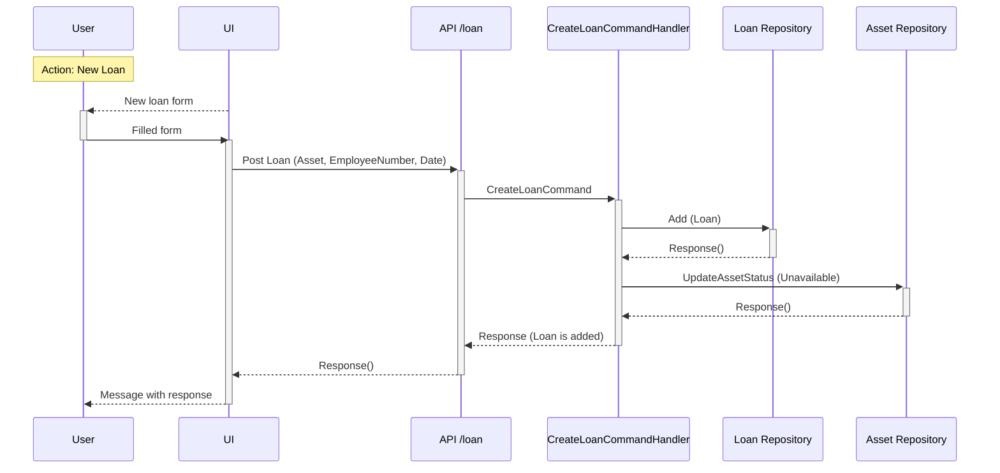
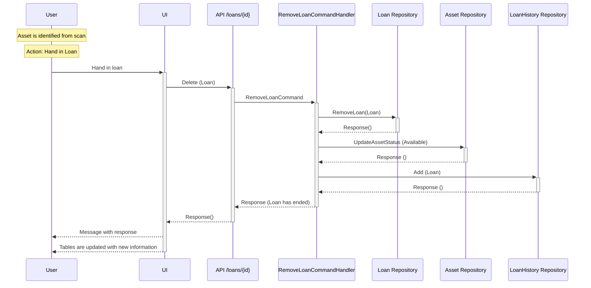

# Loan

## New Loan

```mermaid
sequenceDiagram
   
    Note over User : Action: New Loan
    UI -->>+ User : New loan form
    User ->>- UI : Filled form
    Activate UI 
        UI ->>+ API /loan : Post Loan (Asset, EmployeeNumber, Date)
        API /loan ->>+ CreateLoanCommandHandler : CreateLoanCommand
        CreateLoanCommandHandler ->>+ Loan Repository : Add (Loan)
        Loan Repository -->>- CreateLoanCommandHandler : Response()
        CreateLoanCommandHandler ->>+ Asset Repository : UpdateAssetStatus (Unavailable)
        Asset Repository -->>- CreateLoanCommandHandler : Response()   
        CreateLoanCommandHandler -->>- API /loan : Response (Loan is added) 
        API /loan -->>- UI : Response()
    
        UI -->> User : Message with response
    Deactivate UI
        
    
    
```
## Hand in Loan

```mermaid
sequenceDiagram
    Note over User : Asset is identified from scan

    Note over User : Action: Hand in Loan
    
    User ->>+ UI: Hand in loan
   
    UI ->>+ API /loans/{id} : Delete (Loan)
    
    API /loans/{id}  ->>+ RemoveLoanCommandHandler : RemoveLoanCommand
    
    RemoveLoanCommandHandler ->>+ Loan Repository : RemoveLoan(Loan)
    
    Loan Repository -->>- RemoveLoanCommandHandler : Response()
    
    RemoveLoanCommandHandler ->>+ Asset Repository : UpdateAssetStatus (Available)
    
    Asset Repository -->>- RemoveLoanCommandHandler : Response ()
    
    RemoveLoanCommandHandler ->>+ LoanHistory Repository : Add (Loan)
    
    LoanHistory Repository -->>- RemoveLoanCommandHandler : Response ()
    
    RemoveLoanCommandHandler -->>- API /loans/{id}  : Response (Loan has ended) 
    
    API /loans/{id}  -->>- UI : Response()
    
    UI -->> User : Message with response
    
    UI -->>- User : Tables are updated with new information
  
```