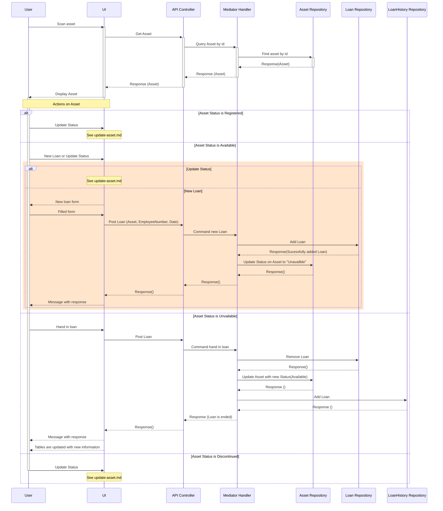

# Loan
## New loan or hand in loan

```mermaid
sequenceDiagram
    User ->> UI : Scan asset
    Activate UI
        UI ->>+ API Controller: Get Asset
        API Controller ->>+ Mediator Handler : Query Asset by id
        Mediator Handler ->>+ Asset Repository : Find asset by id
        Asset Repository -->>- Mediator Handler : Response(Asset)
        Mediator Handler -->>- API Controller : Response (Asset)
        API Controller -->>- UI : Response (Asset)
        UI -->> User: Display Asset

        Deactivate UI
        Activate User

        Note over User, UI: Actions on Asset

        Alt Asset Status is Registered
            User ->> UI: Update Status
                    
            Note over UI: See update-asset.md 
        Else Asset Status is Available
            User ->> UI: New Loan or Update Status
            rect rgb(255, 229, 204)
                Alt Update Status
                    Note over UI: See update-asset.md 
                else New Loan
                    UI -->> User : New loan form
                    User ->> UI : Filled form 
                    UI ->> API Controller : Post Loan (Asset, EmployeeNumber, Date)
                    API Controller ->> Mediator Handler : Command new Loan
                    Mediator Handler ->> Loan Repository : Add Loan
                    Loan Repository -->> Mediator Handler : Response(Sucessfully added Loan)
                    Mediator Handler ->> Asset Repository : Update Status on Asset to "Unavailble"
                    Asset Repository -->> Mediator Handler : Response()   
                    Mediator Handler -->> API Controller : Response() 
                    API Controller -->> UI : Response()
                    UI -->> User : Message with response
                end
            End
        Else Asset Status is Unvailable
            User ->> UI: Hand in loan
            UI ->> API Controller : Post Loan
            API Controller ->> Mediator Handler : Command hand in loan
            Mediator Handler ->> Loan Repository : Remove Loan
            Loan Repository -->> Mediator Handler : Response()

            Mediator Handler ->> Asset Repository : Update Asset with new Status(Available)
            Asset Repository -->> Mediator Handler : Response ()
            Mediator Handler ->> LoanHistory Repository : Add Loan
            LoanHistory Repository -->> Mediator Handler : Response ()
            Mediator Handler -->> API Controller : Response (Loan is ended) 
            API Controller -->> UI : Response()
            UI -->> User : Message with response
            UI -->> User : Tables are updated with new information
        Else Asset Status is Discontinued
            User ->> UI: Update Status
        Deactivate User
            Note over UI: See update-asset.md 

        End
    
    
```