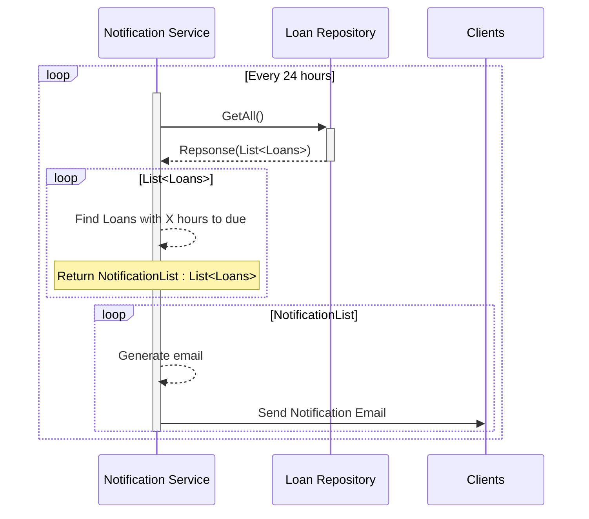

# Notification
## Notify employee when Loan is due to be returned

```mermaid
sequenceDiagram
    loop Every 24 hours
        

        Activate Notification Service 
            Notification Service ->>+ Loan Repository : GetAll()
            Loan Repository -->>- Notification Service : Repsonse(List<Loans>)
            Loop List<Loans>
                Notification Service -->> Notification Service : Find Loans with X hours to due
                Note over Notification Service : Return NotificationList : List<Loans>

            end
            Loop NotificationList
                Notification Service -->> Notification Service : Generate email
                Notification Service ->> Clients : Send Notification Email
            end

            
        Deactivate Notification Service
    end
   
   
```