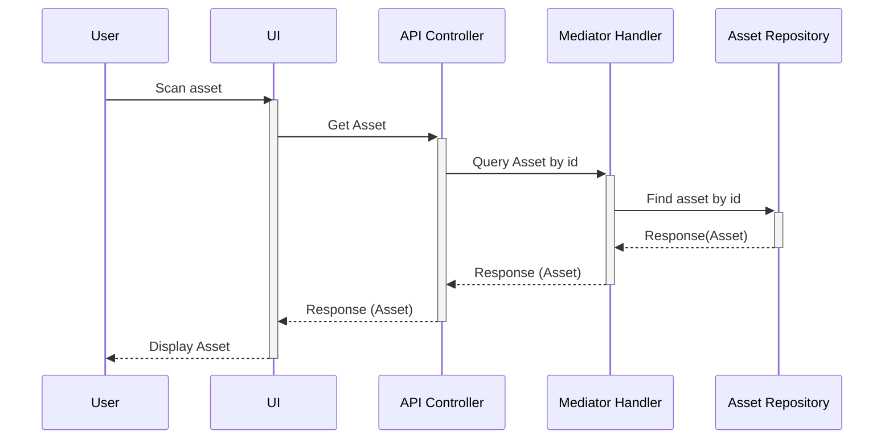

# Get Asset
## View one asset from scan

```mermaid
sequenceDiagram
User ->> UI : Scan asset
    Activate UI
        UI ->>+ API Controller: Get Asset
        API Controller ->>+ Mediator Handler : Query Asset by id
        Mediator Handler ->>+ Asset Repository : Find asset by id
        Asset Repository -->>- Mediator Handler : Response(Asset)
        Mediator Handler -->>- API Controller : Response (Asset)
        API Controller -->>- UI : Response (Asset)
        UI -->> User: Display Asset

    Deactivate UI

```