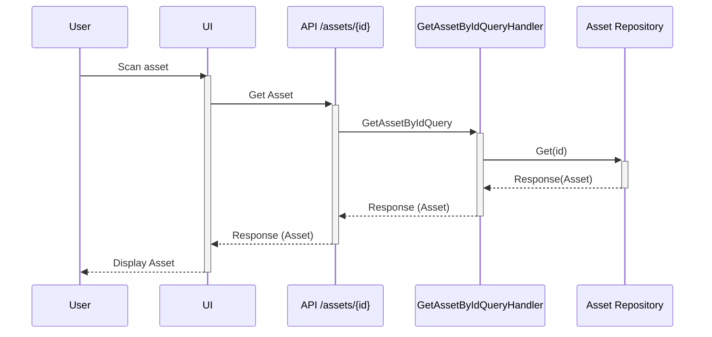
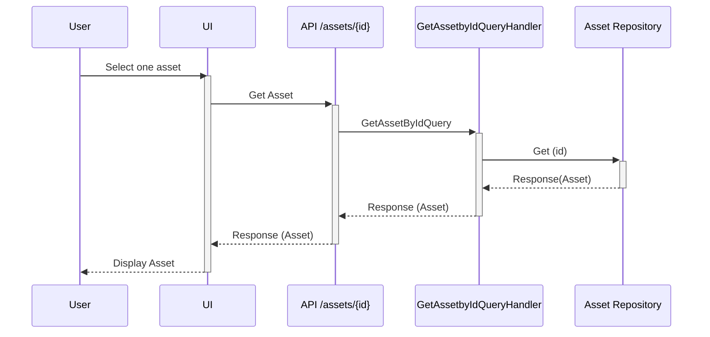
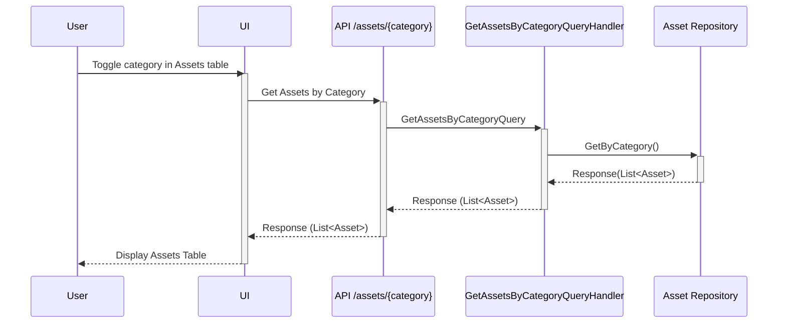

# Read Asset
## View one asset from scan

```mermaid
sequenceDiagram
User ->> UI : Scan asset
    Activate UI
        UI ->>+ API /assets/{id}: Get Asset
        API /assets/{id} ->>+ GetAssetByIdQueryHandler : GetAssetByIdQuery
        GetAssetByIdQueryHandler ->>+ Asset Repository : Get(id)
        Asset Repository -->>- GetAssetByIdQueryHandler : Response(Asset)
        GetAssetByIdQueryHandler -->>- API /assets/{id} : Response (Asset)
        API /assets/{id} -->>- UI : Response (Asset)
        UI -->> User: Display Asset
    Deactivate UI

```
## View one asset from table

```mermaid
sequenceDiagram
User ->> UI : Select one asset
   Activate UI
        UI ->>+ API /assets/{id}: Get Asset
        API /assets/{id} ->>+ GetAssetbyIdQueryHandler : GetAssetByIdQuery
        GetAssetbyIdQueryHandler ->>+ Asset Repository : Get (id)
        Asset Repository -->>- GetAssetbyIdQueryHandler : Response(Asset)
        GetAssetbyIdQueryHandler -->>- API /assets/{id} : Response (Asset)
        API /assets/{id} -->>- UI : Response (Asset)
        UI -->> User: Display Asset
    Deactivate UI

```
## View all assets

```mermaid
sequenceDiagram
User ->> UI : View table of Assets
    Activate UI
        UI ->>+ API /assets: Get Assets
        API /assets ->>+ GetAssetsQueryHandler : GetAssetsQuery
        GetAssetsQueryHandler ->>+ Asset Repository : GetAll()
        Asset Repository -->>- GetAssetsQueryHandler : Response(List<Asset>)
        GetAssetsQueryHandler -->>- API /assets : Response (List<Asset>)
        API /assets -->>- UI : Response (List<Asset>)
        UI -->> User: Display Asset
    Deactivate UI

```

## View assets by category

```mermaid
sequenceDiagram
User ->> UI : Toggle category in Assets table
    Activate UI
        UI ->>+ API /assets/{category}: Get Assets by Category 
        API /assets/{category} ->>+ GetAssetsByCategoryQueryHandler : GetAssetsByCategoryQuery
        GetAssetsByCategoryQueryHandler ->>+ Asset Repository : GetByCategory()
        Asset Repository -->>- GetAssetsByCategoryQueryHandler : Response(List<Asset>)
        GetAssetsByCategoryQueryHandler -->>- API /assets/{category} : Response (List<Asset>)
        API /assets/{category} -->>- UI : Response (List<Asset>)
        UI -->> User: Display Assets Table
    Deactivate UI

```