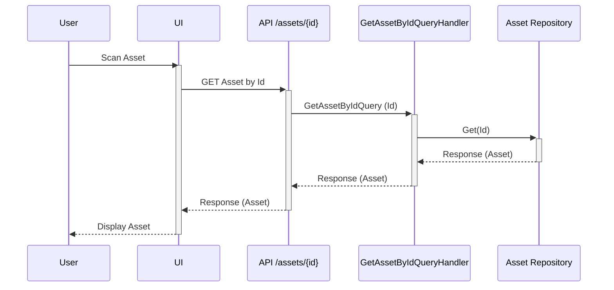
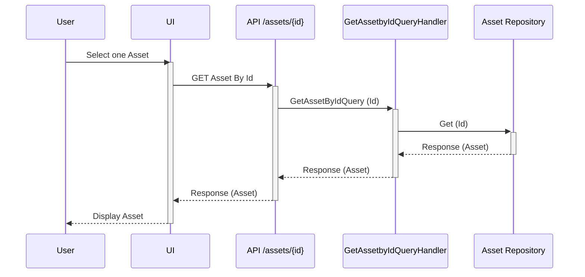
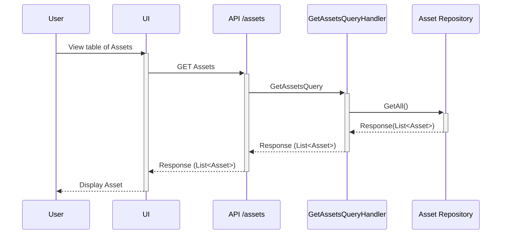
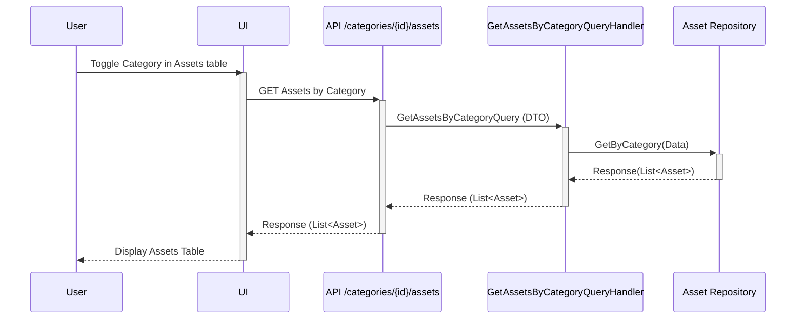

# Read Asset
- [View one Asset from scan](#view-one-asset-from-scan)
- [View one Asset from table](#view-one-asset-from-table)
- [View all Assets](#view-all-assets)
- [View Assets by Category](#view-assets-by-category)
## View one Asset from scan

## View one Asset from table

## View all Assets

## View Assets by Category
