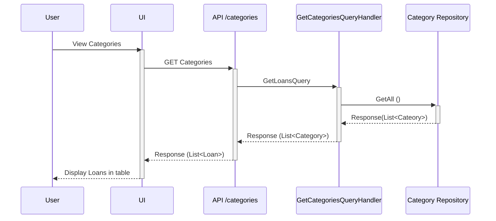

# Read Category

```mermaid
sequenceDiagram
User ->> UI : View Categories 
    Activate UI
        UI ->>+ API /categories: GET Categories
        API /categories ->>+ GetCategoriesQueryHandler : GetLoansQuery
        GetCategoriesQueryHandler ->>+ Category Repository : GetAll ()
        Category Repository -->>- GetCategoriesQueryHandler : Response(List<Cateory>)
        GetCategoriesQueryHandler -->>- API /categories : Response (List<Category>)
        API /categories -->>- UI : Response (List<Loan>)
        UI -->> User: Display Loans in table
    Deactivate UI

```
