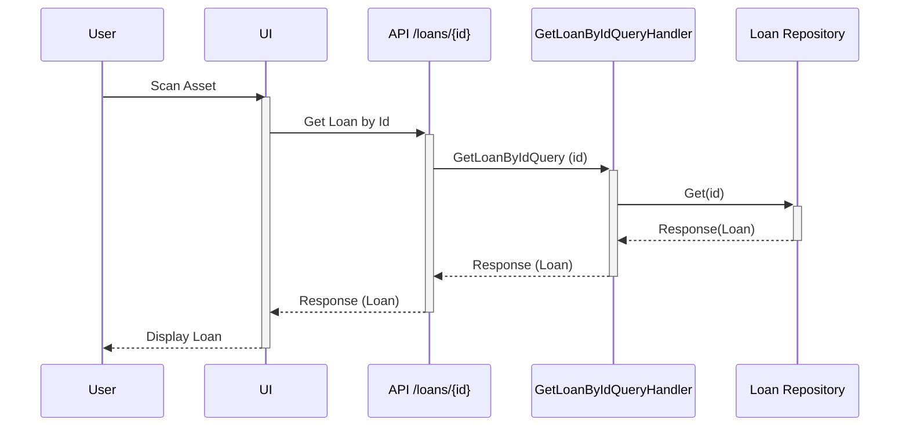
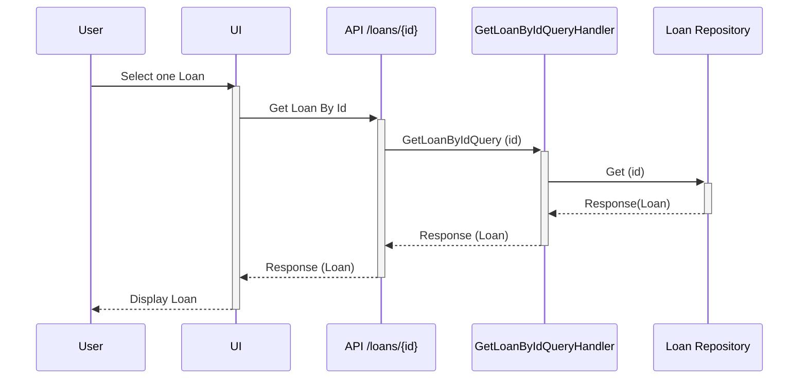
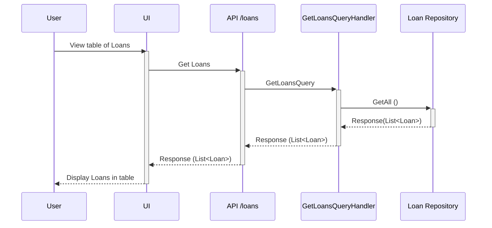
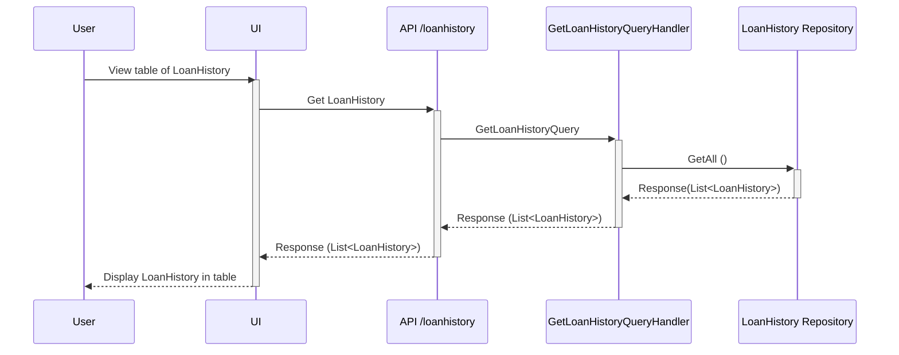

# Read Loan
## View one Loan from scan

```mermaid
sequenceDiagram
User ->> UI : Scan Asset
    Activate UI
        UI ->>+ API /loans/{id}: Get Loan by Id
        API /loans/{id} ->>+ GetLoanByIdQueryHandler : GetLoanByIdQuery (id)
        GetLoanByIdQueryHandler ->>+ Loan Repository : Get(id)
        Loan Repository -->>- GetLoanByIdQueryHandler : Response(Loan)
        GetLoanByIdQueryHandler -->>- API /loans/{id} : Response (Loan)
        API /loans/{id} -->>- UI : Response (Loan)
        UI -->> User: Display Loan
    Deactivate UI

```
## View one Loan from table

```mermaid
sequenceDiagram
User ->> UI : Select one Loan
   Activate UI
        UI ->>+ API /loans/{id}: Get Loan By Id
        API /loans/{id} ->>+ GetLoanByIdQueryHandler : GetLoanByIdQuery (id)
        GetLoanByIdQueryHandler ->>+ Loan Repository : Get (id)
        Loan Repository -->>- GetLoanByIdQueryHandler : Response(Loan)
        GetLoanByIdQueryHandler -->>- API /loans/{id} : Response (Loan)
        API /loans/{id} -->>- UI : Response (Loan)
        UI -->> User: Display Loan
    Deactivate UI

```
## View all Loans

```mermaid
sequenceDiagram
User ->> UI : View table of Loans
    Activate UI
        UI ->>+ API /loans: Get Loans
        API /loans ->>+ GetLoansQueryHandler : GetLoansQuery
        GetLoansQueryHandler ->>+ Loan Repository : GetAll ()
        Loan Repository -->>- GetLoansQueryHandler : Response(List<Loan>)
        GetLoansQueryHandler -->>- API /loans : Response (List<Loan>)
        API /loans -->>- UI : Response (List<Loan>)
        UI -->> User: Display Loans in table
    Deactivate UI

```

## View LoanHistory

```mermaid
sequenceDiagram
User ->> UI : View table of LoanHistory
    Activate UI
        UI ->>+ API /loanhistory: Get LoanHistory
        API /loanhistory ->>+ GetLoanHistoryQueryHandler : GetLoanHistoryQuery
        GetLoanHistoryQueryHandler ->>+ LoanHistory Repository : GetAll ()
        LoanHistory Repository -->>- GetLoanHistoryQueryHandler : Response(List<LoanHistory>)
        GetLoanHistoryQueryHandler -->>- API /loanhistory : Response (List<LoanHistory>)
        API /loanhistory -->>- UI : Response (List<LoanHistory>)
        UI -->> User: Display LoanHistory in table
    Deactivate UI

```