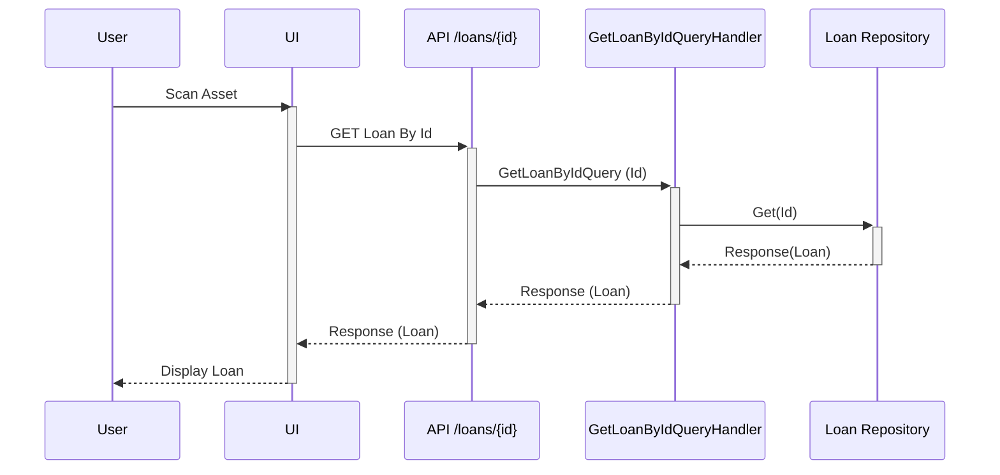
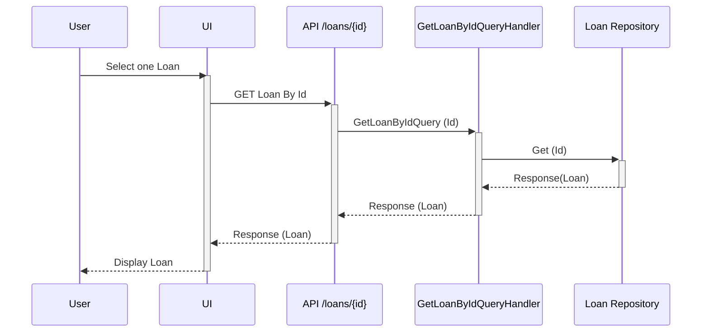
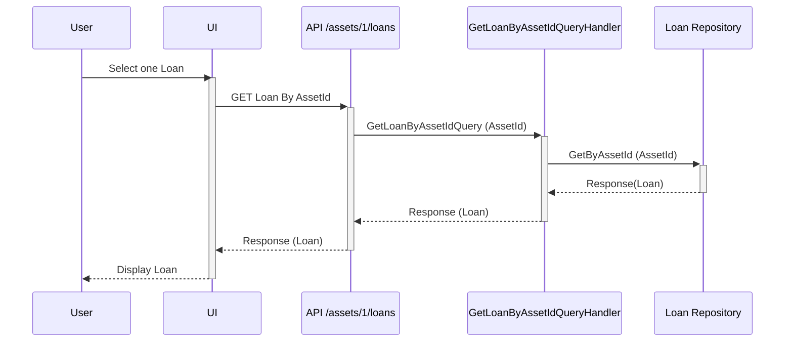
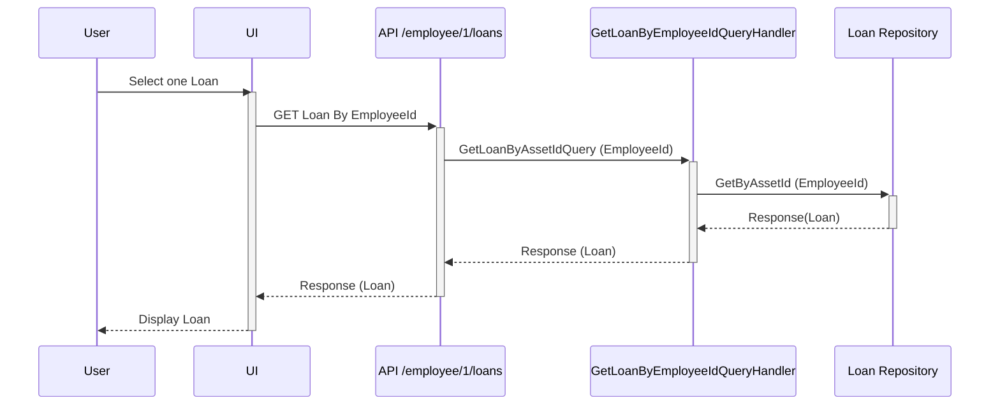
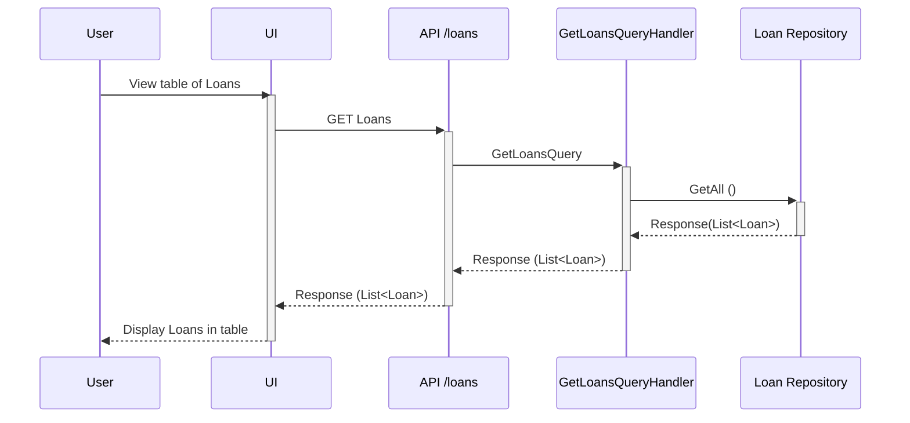
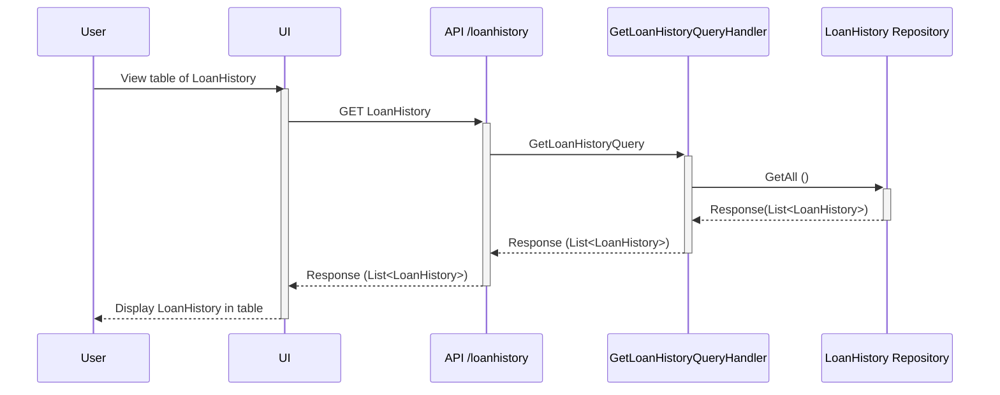

# Read Loan
- [View one Loan from scan](#view-one-loan-from-scan)
- [View one Loan from table](#view-one-loan-from-table)
- [View Loan by Asset Id](#view-loan-by-asset-id)
- [View Loan by Employee Id](#view-loan-by-employee-id)
- [View all Loans](#view-all-loans)
- [View Loan History](#view-loan-history)
## View one Loan from scan

## View one Loan from table

## View Loan by Asset Id

## View Loan by Employee Id

## View all Loans

## View Loan History
