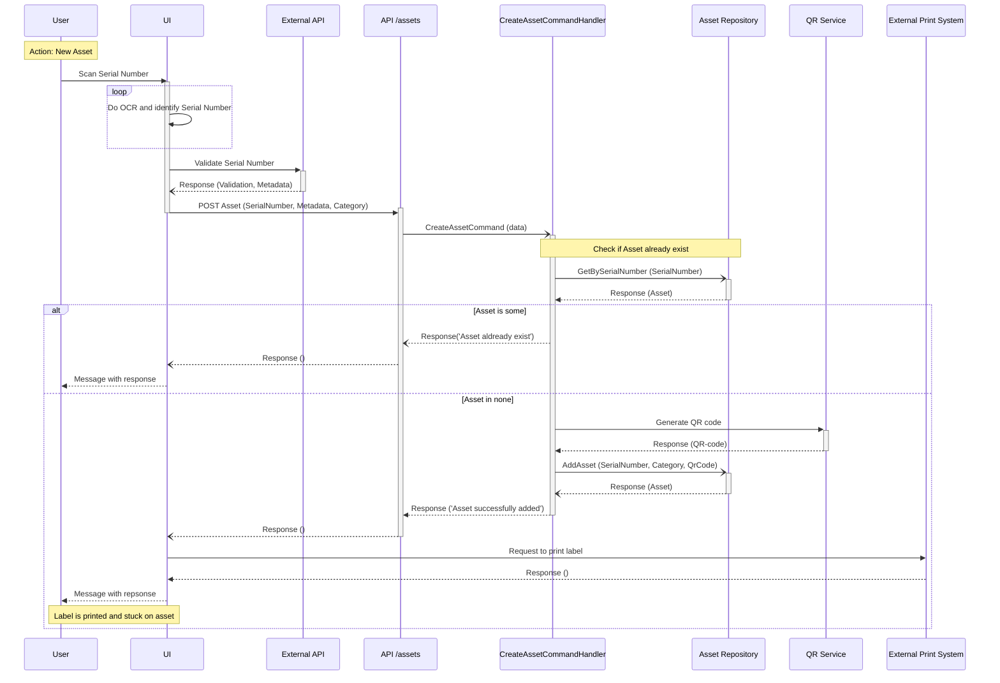
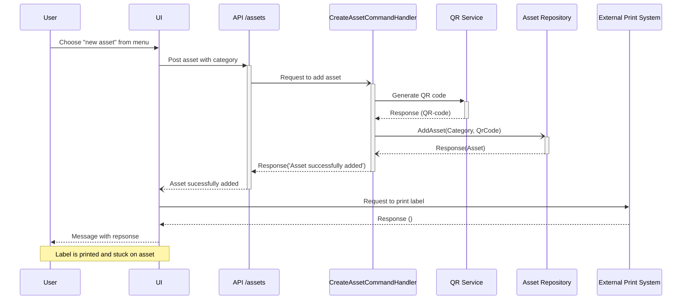

# Tag new asset
## Tag asset with a Serial Number

```mermaid
sequenceDiagram
    Note over User: Action: New Asset
    User ->> UI : Scan Serial Number
    Activate UI
        loop 
            UI ->> UI : Do OCR and identify Serial Number
        end
            UI  ->>+ External API: Validate Serial Number
   
                External API --)- UI : Response (Validation, Metadata)
                UI ->>+ API /assets: POST Asset (SerialNumber, Metadata, Category)
    Deactivate UI
                    API /assets -)+ CreateAssetCommandHandler : CreateAssetCommand (data)
                        Note over CreateAssetCommandHandler, Asset Repository : Check if Asset already exist
                        CreateAssetCommandHandler -)+ Asset Repository : GetBySerialNumber (SerialNumber) 
                        Asset Repository  -->>- CreateAssetCommandHandler : Response (Asset)
                    
            alt Asset is some
                        
                    CreateAssetCommandHandler --) API /assets : Response('Asset aldready exist')
                API /assets --) UI  : Response ()
            UI -->> User : Message with response
                
            else Asset in none
                    
                        CreateAssetCommandHandler ->>+ QR Service : Generate QR code
                        QR Service -->>- CreateAssetCommandHandler : Response (QR-code)

                        CreateAssetCommandHandler -)+ Asset Repository : AddAsset (SerialNumber, Category, QrCode)
                        Asset Repository  --)- CreateAssetCommandHandler : Response (Asset)

                    CreateAssetCommandHandler -->>- API /assets : Response ('Asset successfully added')
                API /assets --)- UI  : Response ()
                UI ->> External Print System : Request to print label
                External Print System -->> UI : Response ()
            UI -->> User : Message with repsonse
            Note over User, UI: Label is printed and stuck on asset
            end
        
```

## Tag asset without Serial Number

```mermaid
sequenceDiagram
    User ->> UI : Choose "new asset" from menu
        UI ->>+ API /assets: Post asset with category
            API /assets -)+ CreateAssetCommandHandler : Request to add asset
                CreateAssetCommandHandler ->>+ QR Service : Generate QR code
                QR Service -->>- CreateAssetCommandHandler : Response (QR-code)
                
                CreateAssetCommandHandler -)+ Asset Repository : AddAsset(Category, QrCode)
                Asset Repository  --)- CreateAssetCommandHandler : Response(Asset)
                
            CreateAssetCommandHandler -->>- API /assets : Response('Asset successfully added')
        API /assets --)- UI  : Asset sucessfully added
        UI ->> External Print System : Request to print label
        External Print System -->> UI : Response ()
    UI -->> User : Message with repsonse
    Note over User, UI: Label is printed and stuck on asset
        

```