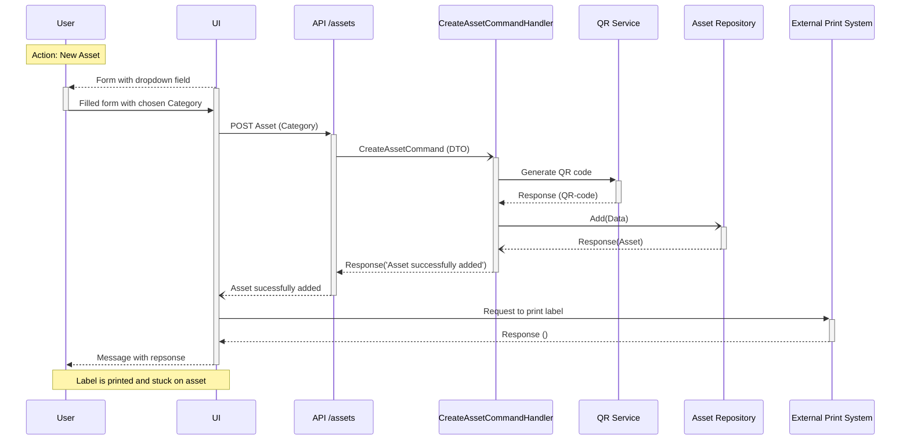

# Tag new Assets
- [Tag Asset with Serial Number](#tag-asset-with-serial-number)
- [Tag Asset without Serial Number](#tag-asset-without-serial-number)
## Tag Asset with Serial Number

## Tag asset without Serial Number
