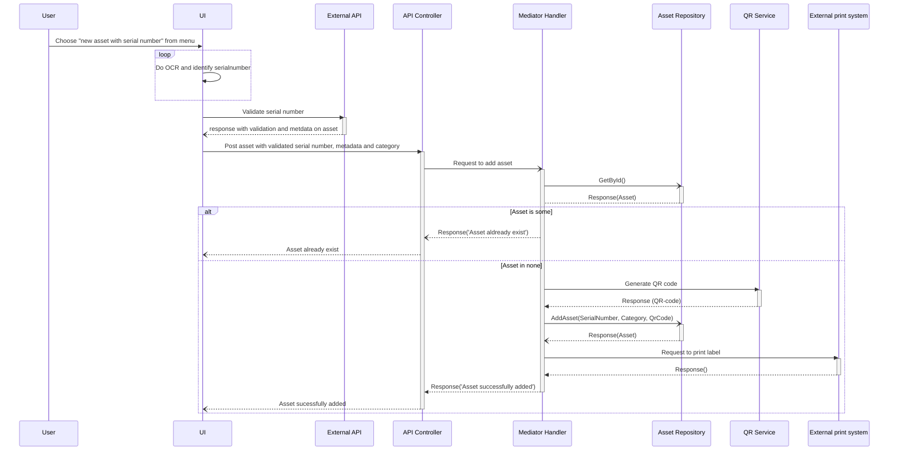
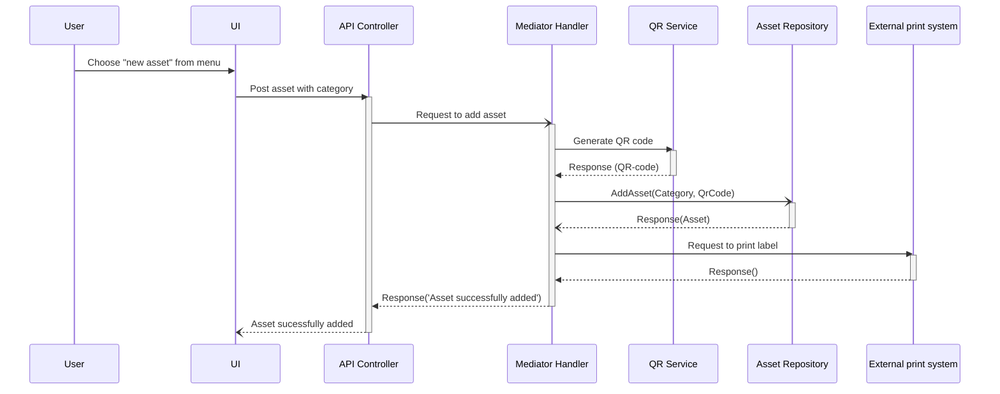

# Tag new asset
## Tag asset with a serial number

```mermaid
sequenceDiagram
    User ->> UI : Choose "new asset with serial number" from menu

    loop 
        UI ->> UI : Do OCR and identify serialnumber
    end

    UI  ->> External API: Validate serial number

    activate External API
        External API --) UI : response with validation and metdata on asset
    deactivate External API
    
    UI ->>API Controller: Post asset with validated serial number, metadata and category

    Activate API Controller
        
        API Controller -) Mediator Handler : Request to add asset
        
        Activate Mediator Handler

            Mediator Handler -) Asset Repository : GetById() 

            Activate Asset Repository
                Asset Repository  --> Mediator Handler : Response(Asset)
            Deactivate Asset Repository
    
            alt Asset is some
                
                Mediator Handler --) API Controller : Response('Asset aldready exist')
                
                API Controller --) UI  : Asset already exist
            
            else Asset in none
                
                Mediator Handler ->> QR Service : Generate QR code
                
                Activate QR Service
                    QR Service -->> Mediator Handler : Response (QR-code)
                Deactivate QR Service

                Mediator Handler -) Asset Repository : AddAsset(SerialNumber, Category, QrCode)
                
                activate Asset Repository
                    Asset Repository  --) Mediator Handler : Response(Asset)
                deactivate Asset Repository 
                
                Mediator Handler ->> External print system: Request to print label 
                
                Activate External print system
                    External print system -->> Mediator Handler : Response()
                Deactivate External print system


                Mediator Handler -->> API Controller : Response('Asset successfully added')
        
        Deactivate Mediator Handler
    
                API Controller --) UI  : Asset sucessfully added
    
    Deactivate API Controller

            end
```

## Tag asset without serial number

```mermaid
sequenceDiagram
    User ->> UI : Choose "new asset" from menu
    
    UI ->> API Controller: Post asset with category

    Activate API Controller
        
        API Controller -) Mediator Handler : Request to add asset
        
        Activate Mediator Handler
                          
                Mediator Handler ->> QR Service : Generate QR code
                
                Activate QR Service
                    QR Service -->> Mediator Handler : Response (QR-code)
                Deactivate QR Service

                Mediator Handler -) Asset Repository : AddAsset(Category, QrCode)
                
                activate Asset Repository
                    Asset Repository  --) Mediator Handler : Response(Asset)
                deactivate Asset Repository 
                
                Mediator Handler ->> External print system: Request to print label 
                
                Activate External print system
                    External print system -->> Mediator Handler : Response()
                Deactivate External print system

                Mediator Handler -->> API Controller : Response('Asset successfully added')
        
        Deactivate Mediator Handler
    
                API Controller --) UI  : Asset sucessfully added
    
    Deactivate API Controller

           
```