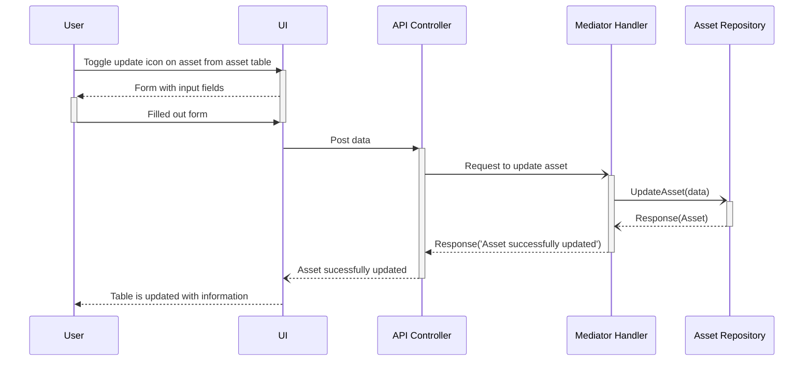
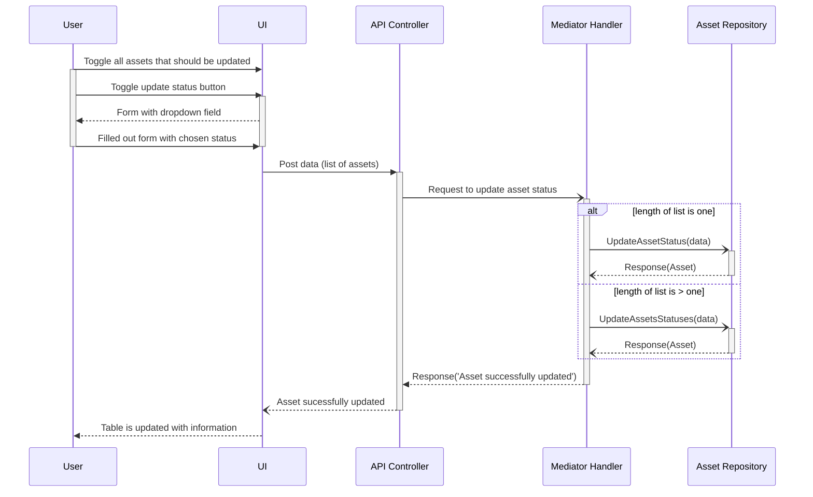
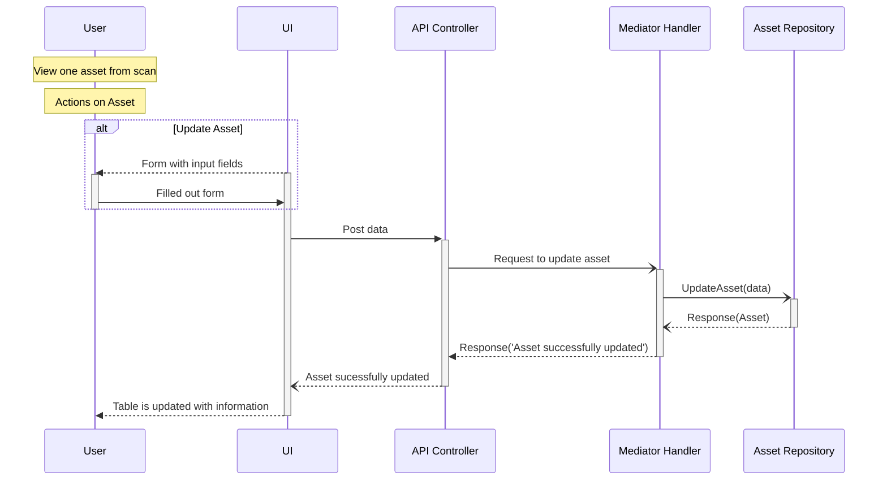

# Update asset
## Update asset information

## Update asset status on one or more assets

## Update asset information and status from scan
### Used sequences in this diagram
- [View one asset from scan](read-asset.md#view-one-asset-from-scan)
