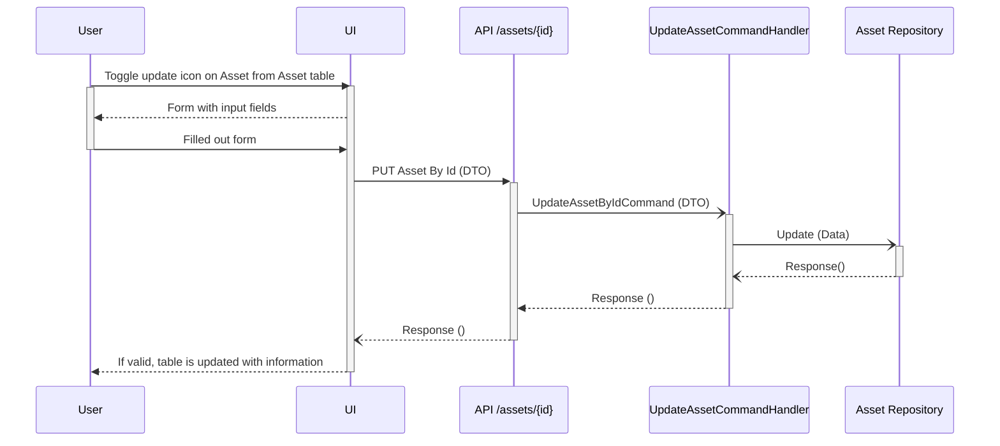
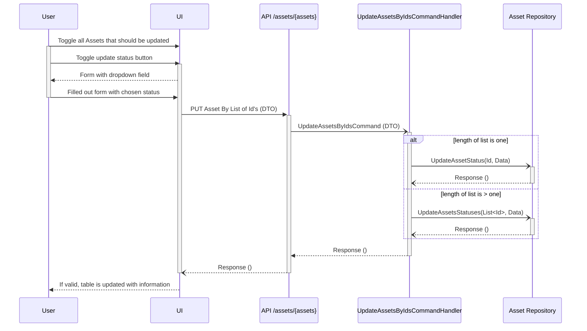
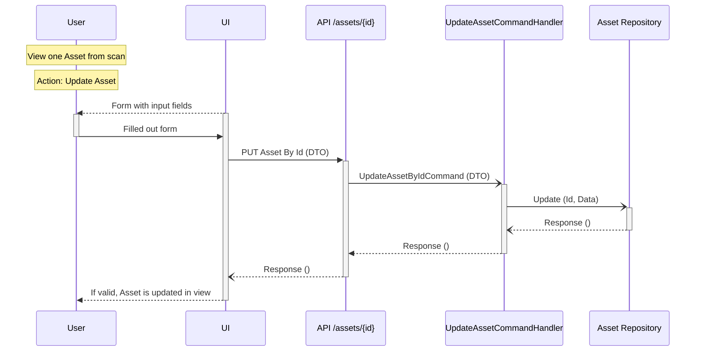

# Update Asset
- [Update Asset information](#update-asset-information)
- [Update Asset Status on one or more Assets](#update-asset-status-on-one-or-more-assets)
- [Update Asset information and status from scan](#update-asset-information-and-status-from-scan)

## Update Asset information

## Update Asset Status on one or more Assets

## Update Asset information and status from scan
### Used sequences in this diagram
- [View one Asset from scan](read-Asset.md#view-one-Asset-from-scan)
