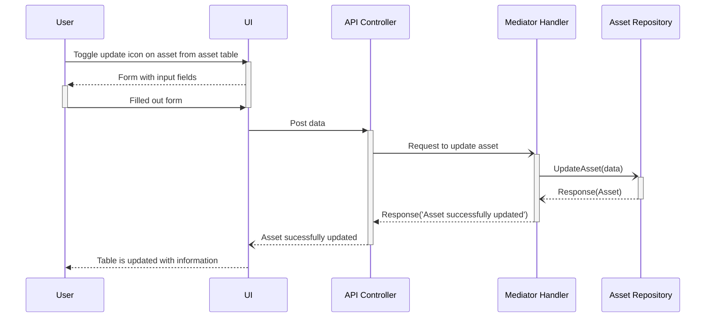
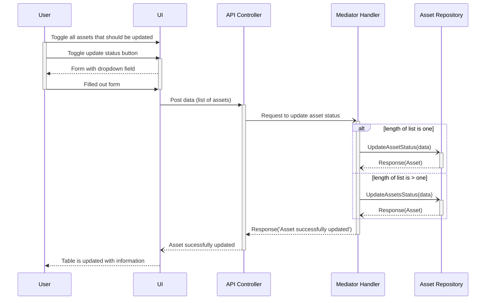

# Update asset
## Update asset information

```mermaid
sequenceDiagram
    User ->> UI : Toggle update icon on asset from asset table
    
    Activate UI
        UI -->>+ User : Form with input fields
        User ->>- UI : Filled out form
    Deactivate UI
    
    UI ->>+ API Controller: Post data
    API Controller -)+ Mediator Handler : Request to update asset
        
    Mediator Handler -)+ Asset Repository : UpdateAsset(data)
            
    Asset Repository  --)- Mediator Handler : Response(Asset)
                    
    Mediator Handler -->>- API Controller : Response('Asset successfully updated')
    
    API Controller --)- UI  : Asset sucessfully updated
    
    UI -->> User : Table is updated with information
```
## Update asset status on one or more assets

```mermaid
sequenceDiagram
    User ->> UI : Toggle all assets that should be updated
    
    Activate User
        User ->> UI : Toggle update status button
        
        Activate UI
            UI -->> User : Form with dropdown field
            User ->> UI : Filled out form
        Deactivate UI
    
    Deactivate User
    
    UI ->>+ API Controller: Post data (list of assets)
    
    API Controller -)+ Mediator Handler : Request to update asset status

    alt length of list is one
        Mediator Handler -)+ Asset Repository : UpdateAssetStatus(data) 
        Asset Repository  --)- Mediator Handler : Response(Asset) 
    else length of list is > one
        Mediator Handler -)+ Asset Repository : UpdateAssetsStatus(data) 
        Asset Repository  --)- Mediator Handler : Response(Asset) 
    end
        
    Mediator Handler -->>- API Controller : Response('Asset successfully updated')
            
    API Controller --)- UI  : Asset sucessfully updated
    
    UI -->> User : Table is updated with information
     
```
